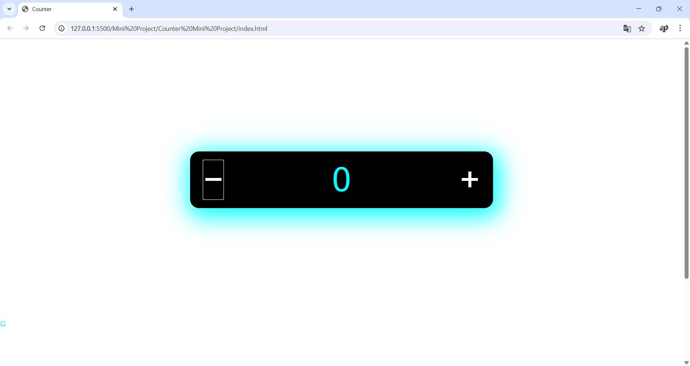

# 🔢 Counter Mini Project  

A sleek and interactive **JavaScript Counter Application** that demonstrates **DOM manipulation** and **event handling**.  
Easily **increment** or **decrement** values with stylish glowing buttons and an **Add to Cart** feature!  

---

## ✨ Features  
✅ Increment & Decrement counter values  
✅ Dynamic text update on button click  
✅ Glowing modern UI with responsive design  
✅ Built with **HTML, CSS, and JavaScript**  

---

## 🛠️ Technologies Used  
-   
-   
-   

---

## 📂 Project Structure  
📦 Counter-Mini-Project
┣ 📜 index.html # Main HTML file
┣ 📜 styles.css # Styling and UI design
┗ 📜 script.js # JavaScript logic for increment/decrement

---

## 🚀 Live Demo  
🔗 [Click Here to View Live](https://priyadhar29.github.io/Counter_JS/) 

---

## 📸 Preview  

---

---

---

## 💡 What I Learned  
✔ Using **JavaScript functions** for interactivity  
✔ Handling **onClick events** for DOM updates  
✔ Creating **glowing effects** with CSS for a modern look  

---

### 🌟 Author  
**[PriyaDharshini](https://github.com/Priyadhar29)**  

⭐ If you like this project, don't forget to **star the repo**!  

---

